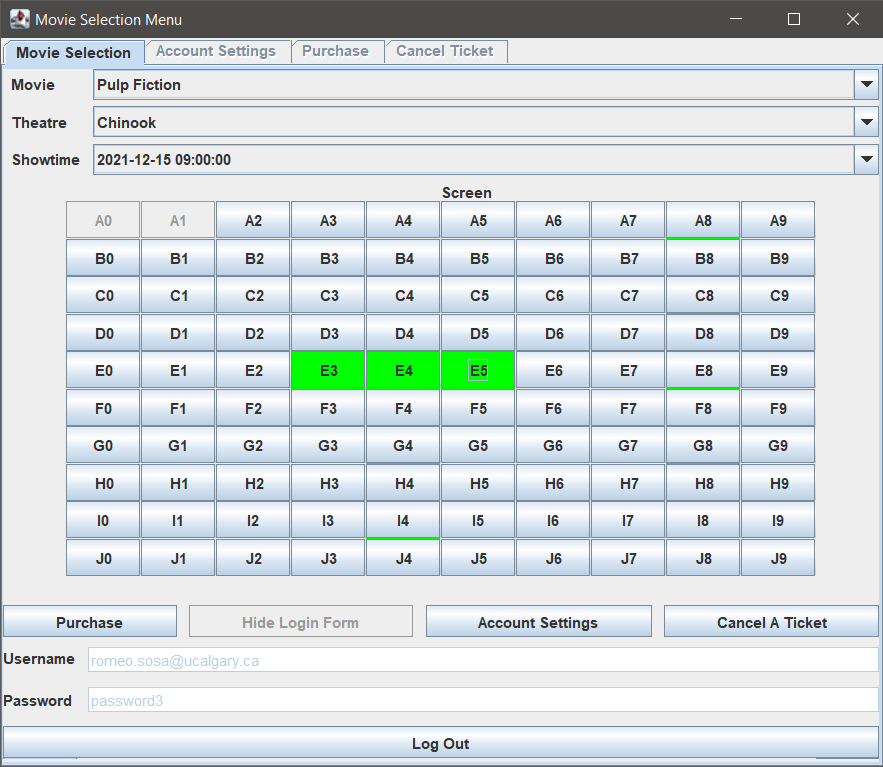
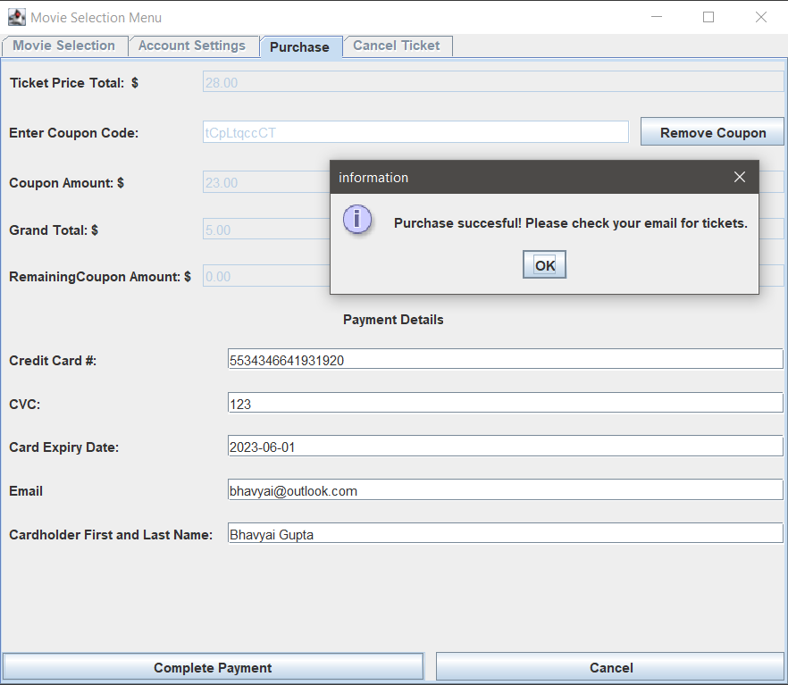
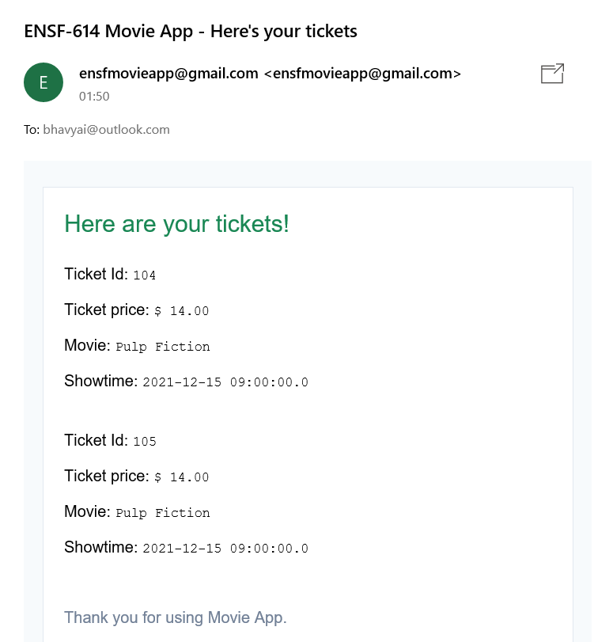
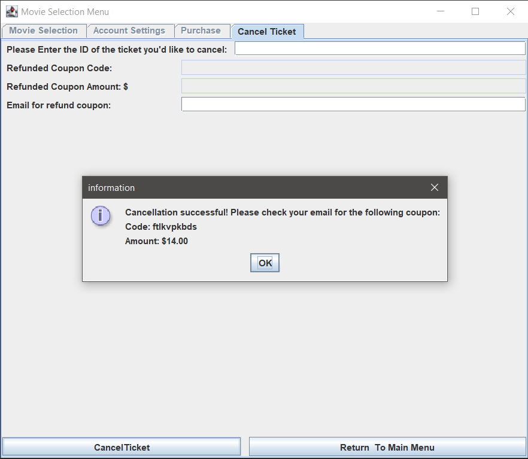
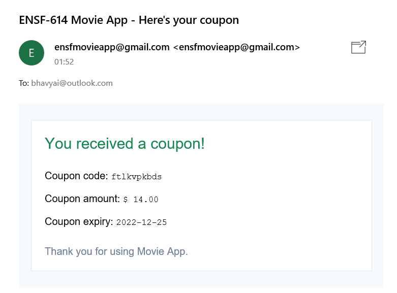

# Movie Ticket Reservation System

A swing GUI based movie ticket reservation system


## Features

+ Registered user can book 10% of the tickets before movie is released

+ Registered user gets full amount back when cancelling the ticket

+ Pay by card or by use your coupon

+ Cannot cancel ticket if movie is playing within 72 hours

+ Email alerts for tickets and coupons


## Project Structure


+ [`config`](config) - contains the config files containing important settings for the project to work

+ [`docs`](docs) - various documents, including system diagrams, of the project
   + [`docs/javadoc.zip`](docs/javadoc.zip) - javadoc as zip archive

+ [`images`](images) - contains screenshots

+ [`lib`](lib) - contains the JARs used by the project

+ [`sql`](sql) - contains the SQL script to create database

+ [`src`](src) - contains all the source code as `.java` files


## Dependencies

+ JDK version 11.0.11 or above

+ MySQL server version 8.0.26 or above


## How to run

1. Clone the repository on your machine

2. Start the MySQL server on your local machine

3. Open the file [config/db_details.properties](config/db_details.properties) and replace existing username and port details with your MySQL server details

4. Connect to your MySQL server using an admin user like `root`

5. Run [this](sql/db_script.sql) SQL script on the MySQL server. This script will create a schema **moviedb** and a user **movieapp**, create all necessary tables, and load them with some dummy data

6. To compile the source code, run the below command

   ```bash
   $ javac -cp ".;lib/*" -sourcepath "src" -d "bin" src/movieTicketSystem/*java src/movieTicketSystem/controller/*java src/movieTicketSystem/model/*java src/movieTicketSystem/view/*java
   ```

7. To run the source code, run the below command

   ```bash
   $ java -cp ".;lib/*;bin" movieTicketSystem.movieApp
   ```


## Screenshots

1. Select movie, theatre and seats

   

2. Make payment for the tickets

   

3. Ticket confirmation email

   

4. Cancel the ticket and get coupon

   

5. Coupon confirmation email

   


## Contributors

+ [Bhavyai Gupta](https://github.com/zbhavyai)
+ [Calvin Giese](https://github.com/calvingiese)
+ [Graydon Hall](https://github.com/GraydonHall42)
+ [Yuhua Guo](https://github.com/davedaveisguo)
